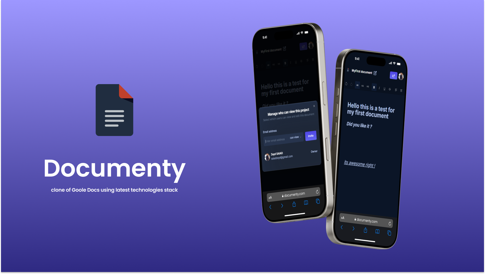

# Live Docs - Real-time Document Editor

Live Docs is a collaborative real-time document editor that allows multiple users to work on the same document simultaneously. Built using modern web technologies, it provides a seamless, efficient, and user-friendly editing experience.




## 🚀 Tech Stack

- **[Next.js](https://nextjs.org/)** - React framework for server-side rendering and static site generation
- **[Clerk](https://clerk.dev/)** - Authentication and user management
- **[Liveblocks](https://liveblocks.io/)** - Real-time collaborative state management
- **[Tailwind CSS](https://tailwindcss.com/)** - Utility-first CSS framework
- **[Lexical Editor](https://lexical.dev/)** - Rich text editor

---

## 🤸 Quick Start

Follow these steps to set up and run the project locally on your machine.

### Prerequisites

Ensure you have the following installed:

- **[Git](https://git-scm.com/)**
- **[Node.js](https://nodejs.org/)** (version 14 or higher)
- **[npm](https://www.npmjs.com/)** (Node Package Manager)

---

### Cloning the Repository

Clone the project from GitHub:

```bash
git clone https://github.com/zeeeeeyd/Live-Docs.git
cd Live-Docs
cd live-docs
```

---

### Installation

Install the required dependencies:

```bash
npm install
```

---

### Set Up Environment Variables

Create a new `.env` file in the root of your project and add the following variables:

```bash
# Clerk
NEXT_PUBLIC_CLERK_PUBLISHABLE_KEY=
CLERK_SECRET_KEY=
NEXT_PUBLIC_CLERK_SIGN_IN_URL=/sign-in
NEXT_PUBLIC_CLERK_SIGN_UP_URL=/sign-up

# Liveblocks
NEXT_PUBLIC_LIVEBLOCKS_PUBLIC_KEY=
LIVEBLOCKS_SECRET_KEY=
```

Replace the placeholders with your actual **Clerk** and **Liveblocks** credentials. You can retrieve these from your Clerk and Liveblocks accounts.

---

### Running the Project

To start the development server, run:

```bash
npm run dev
```

Then, open your browser and navigate to:

```
http://localhost:3000
```

Now you're ready to experience the collaborative real-time document editor locally!

---

Feel free to contribute, report bugs, or suggest new features by opening issues or pull requests on the [GitHub repository](https://github.com/zeeeeeyd/Live-Docs).

---

Enjoy collaborating with **Documenty**! 🎉

